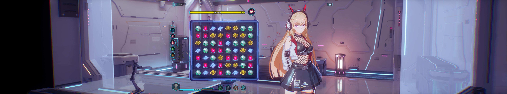

## Mirror 2: Project X ultrawide and wider

The solution removes the side black bars that appear in the game at 21:9 and wider resolutions.

1. [Download the archive](/../../releases).
2. Unpack the files to the \ProjectX\Mirror2\Binaries\Win64\ folder inside the game directory.
3. Launch the game and select the Borderless mode to have it fill your screen irrespective of the selected resolution.

To uninstall, simply remove or move the files.

Tested on the latest Steam version at 2560x1080, 3840x1080 and 5760x1080.

You can buy me a [coffee](https://ko-fi.com/rozziroxx) or become a [patron](https://www.patreon.com/rozzi).

---

## Mirror 2: Project X 超寬以上補丁

此補丁可以移除遊戲內左右黑條並將遊戲解析度拉伸至21:9比例或更寬。

1. [下載此補丁](/../../releases)。
2. 解壓檔案至 \ProjectX\Mirror2\Binaries\Win64\ 遊戲資料夾內。
3. 運行遊戲並選擇無邊框模式以讓遊戲可以無視遊戲設定內所選的解析度並自動最大化顯示遊戲畫面。

如要解除安裝，只需移除掉補丁檔案即可。

此補丁已通過最新Steam版本2560x1080、3840x1080以及5760x1080解析度的測試。

您可以購買一杯[咖啡](https://ko-fi.com/rozziroxx)或成為[贊助者](https://www.patreon.com/rozzi)以支持我的作品。

由KyoriAsh所翻譯

---

### Mirror 2: Project X 超宽以上补丁

此补丁可以移除游戏内左右黑条并将游戏分辨率拉伸至21:9比例或更宽。

1. [下载此补丁](/../../releases)。
2. 解压文件至 \ProjectX\Mirror2\Binaries\Win64\ 游戏文件夹内。
3. 运行游戏并选择无边框模式以让游戏可以无视游戏设定内所选的分辨率并自动最大化显示游戏画面。

如要卸载，只需移除掉补丁文件即可。

此补丁已通过最新Steam版本2560x1080、3840x1080以及5760x1080分辨率的测试。

您可以购买一杯[咖啡](https://ko-fi.com/rozziroxx)或成为[赞助者](https://www.patreon.com/rozzi)以支持我的作品。

由KyoriAsh所翻译
